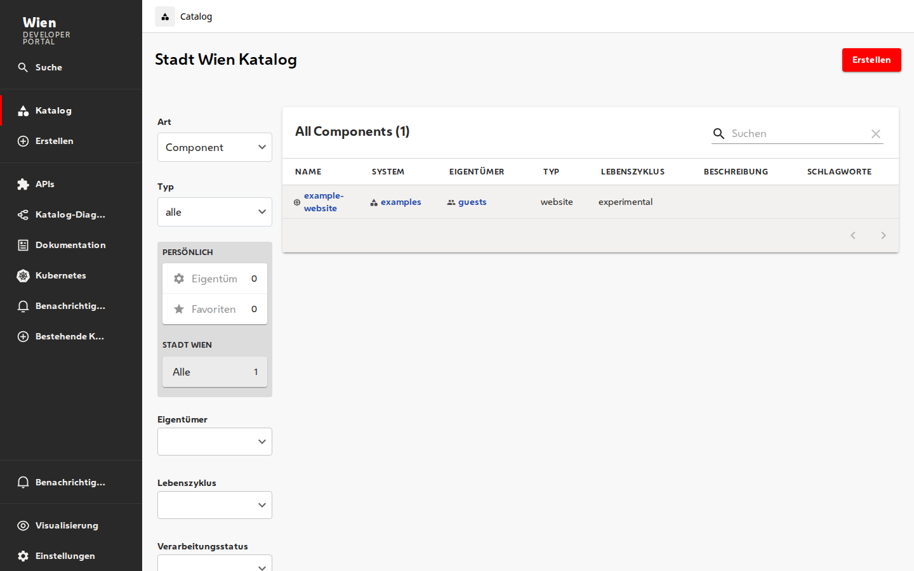
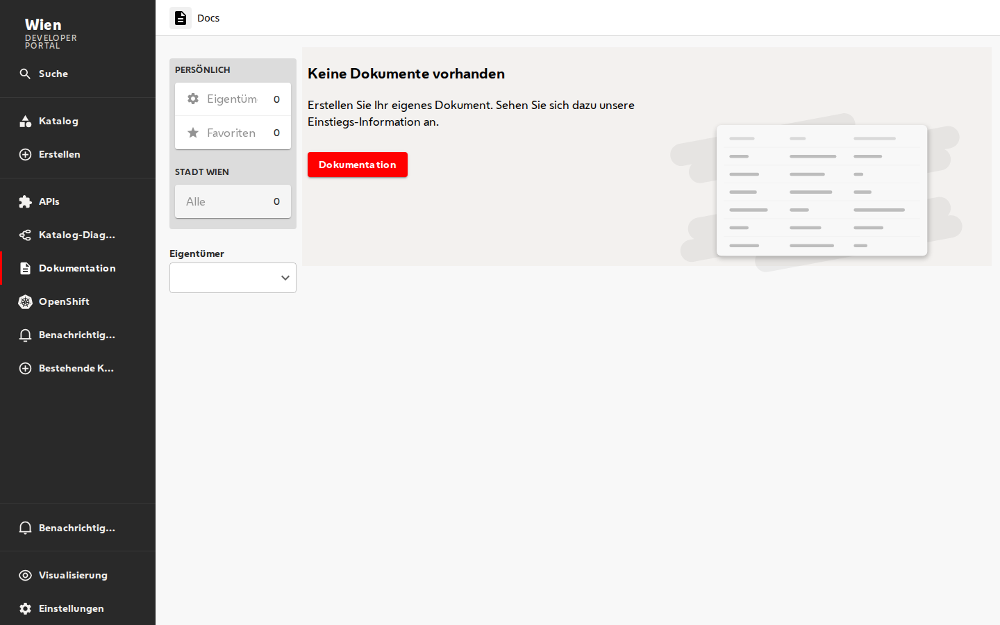
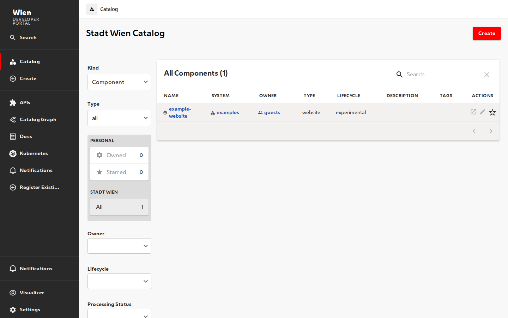

# hackstage — Stadt Wien Corporate Design for Backstage

A drop-in Backstage frontend plugin that turns any vanilla Backstage instance into a **Stadt Wien branded developer portal** — colours, Wiener Melange typography, branded sidebar, and fully bidirectional German/English translations for the core plugins.

## Walkthrough video

[](docs/assets/wien_cd_plugin_full_walkthrough.mp4)

<video src="docs/assets/wien_cd_plugin_full_walkthrough.mp4" controls width="720"></video>

**▶ [Download / play the full walkthrough (MP4, 72 s, 6.4 MB)](docs/assets/wien_cd_plugin_full_walkthrough.mp4)**

GitHub renders the video inline in its repo view but not in every Markdown renderer — if the `<video>` tag doesn't show, use the download link.

### Stills from the walkthrough


*Catalog page on default German — sidebar `Katalog / Erstellen / APIs / Katalog-Diagramm / Dokumentation / OpenShift / Benachrichtigungen / Bestehende Komponente registrieren / Visualisierung / Einstellungen`, red Wien Rot `Erstellen` button, `Stadt Wien Katalog` page title, German filter panel.*



*`/docs` page with a fully translated empty state — "Keine Dokumente vorhanden / Erstellen Sie Ihr eigenes Dokument. Sehen Sie sich dazu unsere Einstiegs-Information an." + red `Dokumentation` button. The upstream Backstage version hard-codes this in JSX literals; wien-cd replaces the whole page.*



*The exact same app after toggling the language dropdown in Settings → Appearance to `English`. Sidebar, filter panel, table column headings, page title, and the `Create` button all flip — no app reload, no code change, and it flips back again bidirectionally.*

---

## Why we did what we did (technical rationale)

Vanilla Backstage ships with:

- a teal/dark **default theme** whose palette doesn't match the wien.gv.at Corporate Design;
- **system fonts** (Roboto / system-ui), not the City of Vienna's **Wiener Melange** variable font;
- **English-only UI strings** for almost every plugin. Even the strings that *are* wired through `@backstage/frontend-plugin-api` translation refs have no public German bundle;
- a generic **sidebar** with no way to inject a Stadt Wien Wappen or wordmark without forking the app shell;
- **hard-coded JSX literals** in a few plugins — the Techdocs empty state is a famous one — where "translating" through the i18n system is impossible.

Rather than solve all of this inside the app (which would couple branding to one specific deployment and rot as we pulled in Backstage updates), we extracted the entire Stadt Wien identity into a **reusable frontend plugin** (`@stadt-wien/backstage-plugin-cd`) that:

1. is a **real Backstage frontend-plugin** (using `createFrontendPlugin` + `createFrontendModule` + the appropriate `*Blueprint` extensions), so Backstage's auto-discovery, extension system and `app-config.yaml` overrides all work as intended;
2. splits responsibilities between `wienCdPlugin` (things that attach anywhere) and `wienCdAppModule` (attaches to the core `app` plugin, because the theme / translation / nav-content inputs upstream are marked `internal: true`);
3. owns a dedicated `wienCdTranslationRef` for everything that no upstream translation ref covers (sidebar group labels, NavItem title overrides, the techdocs empty state). Both English defaults and German overrides live in the package, so **the language toggle under Settings → Appearance switches all of it bidirectionally** — not just the upstream-covered pieces;
4. registers **replacement pages** (currently just `page:app/wien-techdocs`) for the small set of pages whose strings are JSX-hard-coded upstream. We disable the upstream page via `app-config.yaml`, mount our version on the same path, reuse the upstream `routeRef` so links keep resolving.

Net result: a consuming Backstage app can keep the wien-cd plugin up to date with `yarn up`, and upstream Backstage upgrades keep working without us needing to babysit local forks.

---

## What we've done

### The plugin, `@stadt-wien/backstage-plugin-cd`

Lives in `my-backstage-app/plugins/wien-cd/`. Ships two themes, the Wiener Melange font, a branded sidebar, a dedicated translation ref, a Stadt Wien replacement for the Techdocs index page, and German translation bundles for 13 upstream Backstage plugins.

| Extension id                                    | Kind              | What it does                                                                                                                                                                  |
| ----------------------------------------------- | ----------------- | ----------------------------------------------------------------------------------------------------------------------------------------------------------------------------- |
| `theme:app/wien-light`                          | theme             | Light theme "Wien (hell)". Primary = Wien Rot `#ff0000`, secondary = Abendstimmung `#49274b`, background = Nebelgrau Light `#f3f1ef`. Full page-theme map, MUI + Backstage component overrides. |
| `theme:app/wien-dark`                           | theme             | Dark theme "Wien (dunkel)". Same brand palette on `#1b1b1b`.                                                                                                                  |
| `translation:app/*-de` (14 extensions)          | translation       | German message bundles for `user-settings`, `catalog`, `catalog-react`, `scaffolder`, `scaffolder-react`, `api-docs`, `catalog-graph`, `catalog-import`, `notifications`, `search`, `search-react`, `org`, `core-components`, and our own `wien-cd-de`. |
| `translation:app/wien-cd-de`                    | translation       | German for the strings **no upstream ref covers**: sidebar group labels (Suche / Menü / Einstellungen), the `NotificationsSidebarItem` text, NavItem title overrides for every registered page, and the Techdocs empty-state text. |
| `nav-content:app/wien-sidebar`                  | nav-content       | Replaces the default Backstage sidebar. Renders the Wiener Wappen + wordmark, three groups (search modal, menu, settings), notifications item. Title/subtitle are configurable via `app-config.yaml`. |
| `page:app/wien-techdocs`                        | page              | Drop-in replacement for `page:techdocs` (disabled via config). Reuses all the upstream `EntityListProvider` + catalog filters + `EntityListDocsTable`, but short-circuits on 0 entities to render a fully translated `<EmptyState>`.                     |
| `app-root-element:wien-cd/wiener-melange-font`  | app-root-element  | `@font-face` injector. Wiener Melange variable font (~30 KB woff2) is embedded as an inline base64 data URI, so no asset hosting on the consumer side.                        |

### The plugin exports

Stable API (`@stadt-wien/backstage-plugin-cd`):

```ts
import {
  // Raw UnifiedTheme objects for programmatic use (Storybook etc.)
  wienLightTheme, wienDarkTheme,
  // Palette + font stack
  wienColors, wienFontStack,
  // The plugin's own translation ref + a key-slug helper
  wienCdTranslationRef, slugifyNavItemId,
  // German resources keyed by plugin (for legacy Backstage apps that
  // still use `createApp({ translations: ... })` from the old API)
  wienGermanTranslations,
  // Reusable UI components
  WienerWappen, WienSidebarLogoFull, WienSidebarLogo,
} from '@stadt-wien/backstage-plugin-cd';
```

Frontend-system API (`@stadt-wien/backstage-plugin-cd/alpha`):

```ts
import {
  wienCdFeatures,      // [wienCdPlugin, wienCdAppModule] — spread into createApp
  wienCdPlugin,        // just the font loader
  wienCdAppModule,     // themes + translations + sidebar + docs page
} from '@stadt-wien/backstage-plugin-cd/alpha';
```

### The app

`my-backstage-app/packages/app/src` is down to **42 LOC** across four files (`App.tsx`, `App.test.tsx`, `index.tsx`, `setupTests.ts`). No Wien-specific code. All it does is wire the features in:

```tsx
// packages/app/src/App.tsx — the entire Wien integration
import { createApp } from '@backstage/frontend-defaults';
import catalogPlugin from '@backstage/plugin-catalog/alpha';
import { wienCdFeatures } from '@stadt-wien/backstage-plugin-cd/alpha';

export default createApp({
  features: [catalogPlugin, ...wienCdFeatures],
});
```

---

## How to add it to your own Backstage

### 1. Install the plugin

```sh
# npmjs.com (once published)
yarn workspace app add @stadt-wien/backstage-plugin-cd

# or from the Stadt Wien internal registry
yarn workspace app add @stadt-wien/backstage-plugin-cd --registry https://npm.stadt-wien.gv.at

# or from a tarball (air-gapped / quick test)
yarn workspace app add file:./stadt-wien-backstage-plugin-cd-0.2.0.tgz
```

> A ready-built tarball is at `docs/assets/` in release notes / this repo's artifacts. You can also build your own with `yarn workspace @stadt-wien/backstage-plugin-cd pack`.

### 2. Wire it into `App.tsx`

```tsx
import { createApp } from '@backstage/frontend-defaults';
import catalogPlugin from '@backstage/plugin-catalog/alpha';
import { wienCdFeatures } from '@stadt-wien/backstage-plugin-cd/alpha';

export default createApp({
  features: [catalogPlugin, ...wienCdFeatures],
});
```

### 3. Add the config block to `app-config.yaml`

```yaml
app:
  title: Wien Developer Portal   # optional — change to your deployment's name
  extensions:
    # Replace the default Backstage light/dark themes with Stadt Wien.
    - theme:app/light: false
    - theme:app/dark: false

    # Enable the language toggle under Settings → Appearance.
    - api:app/app-language:
        config:
          availableLanguages: [de, en]
          defaultLanguage: de

    # Suppress the auto-generated NavItems the branded sidebar renders
    # in its own groups (avoids duplicate entries).
    - nav-item:search: false
    - nav-item:catalog: false
    - nav-item:scaffolder: false
    - nav-item:user-settings: false

    # Replace the upstream techdocs index with the Wien one so the
    # empty state is fully translatable.
    - page:techdocs: false

    # Wordmark rendered next to the Wiener Wappen in the sidebar.
    - nav-content:app/wien-sidebar:
        config:
          title: Wien
          subtitle: Developer Portal

organization:
  name: Stadt Wien
```

That's it. `yarn start` — the portal loads in Wien Rot with Wiener Melange, the sidebar shows German labels, the Settings → Appearance card has a **Deutsch / English** language dropdown and two Wien theme buttons.

---

## Required Backstage versions

| Component                         | Minimum version     | Why                                                                               |
| --------------------------------- | ------------------- | --------------------------------------------------------------------------------- |
| **Backstage**                     | **1.36**            | The plugin is built on the *new frontend system* (`createFrontendPlugin` + `NavContentBlueprint` + `ThemeBlueprint` + `TranslationBlueprint`). The legacy `createApp` from `@backstage/app-defaults` can still use the raw theme objects (`wienLightTheme`, `wienDarkTheme`) and the `wienGermanTranslations` map programmatically, but will not get the auto-discovery / branded sidebar features. |
| `@backstage/frontend-plugin-api`  | `^0.16.0`           | Provides `createFrontendPlugin`, `createFrontendModule`, `PageBlueprint`, `NavContentBlueprint`, `TranslationBlueprint`, `useTranslationRef`, `createTranslationRef`. |
| `@backstage/plugin-app-react`     | `^0.2.0`            | `ThemeBlueprint`, `TranslationBlueprint`, `NavContentBlueprint`.                  |
| `@backstage/theme`                | `^0.7.0`            | `createUnifiedTheme`, `UnifiedThemeProvider`, `genPageTheme`.                     |
| `zod`                             | `^4.0.0`            | Backstage's `configSchema` option requires a Standard-Schema-compatible zod with JSON Schema conversion. The `zod/v4` subpath export from zod v3 does NOT satisfy this; you need the real zod v4 package. |
| React / React DOM                 | `17` or `18`        | Peer dependency of `@backstage/core-components`.                                  |
| Node                              | `22` or `24`        | Backstage 1.36+ drops Node 20 support.                                            |

Tested against Backstage **1.50.0** (what's in this monorepo today).

---

## Customisation — how to change branding/labels yourself

Everything user-configurable goes into `app-config.yaml`. Component code in the plugin is structured so that you never need to fork the plugin for typical branding tweaks.

### Change the sidebar logo wordmark

```yaml
app:
  extensions:
    - nav-content:app/wien-sidebar:
        config:
          title: Wien
          subtitle: Developer Portal
```

Both fields are optional; omit `subtitle` for a one-line wordmark.

### Change the app title (shown in the browser tab)

```yaml
app:
  title: Wien Entwicklerportal
```

### Change / add German translations

Each plugin-specific bundle lives in `my-backstage-app/plugins/wien-cd/src/i18n/messages/<plugin>.ts`:

```
plugins/wien-cd/src/i18n/
├── deMessages.ts                  # aggregates all bundles into wienGermanTranslations
├── translations.ts                # TranslationBlueprint extensions
├── wienCdTranslationRef.ts        # our own ref — sidebar + NavItem title overrides + techdocs empty state
└── messages/
    ├── apiDocs.ts
    ├── catalog.ts
    ├── catalogGraph.ts
    ├── catalogImport.ts
    ├── catalogReact.ts
    ├── coreComponents.ts
    ├── notifications.ts
    ├── org.ts
    ├── scaffolder.ts
    ├── scaffolderReact.ts
    ├── search.ts
    ├── userSettings.ts
    └── wienCdDe.ts                # German for the wienCdTranslationRef itself
```

To fix a wording, edit the relevant file (each one maps upstream keys → German strings), run `yarn workspace @stadt-wien/backstage-plugin-cd build` and publish a new plugin version. TypeScript enforces that only keys from the upstream `createTranslationRef` are allowed — typos fail the build.

### Change the sidebar layout (groups, order, icons, which NavItems show)

The sidebar is `my-backstage-app/plugins/wien-cd/src/nav/WienSidebarContent.tsx`. It's a normal React component — fork the plugin or ship a second module that replaces the `nav-content:app/wien-sidebar` extension.

Two non-forking escape hatches:
- Per-plugin NavItem titles are served by `wienCdTranslationRef.navItemTitles.*`. Adding a new `page_<pluginId>: "..."` to `wienCdTranslationRef.ts` + `wienCdDe.ts` is enough for *most* new plugins.
- If you want to completely skip the branded sidebar (e.g. to use Backstage's default), disable the extension: `- nav-content:app/wien-sidebar: false` in `app-config.yaml`.

### Change the Wiener Wappen / Wordmark component (for standalone pages, Storybook)

```tsx
import { WienerWappen, WienSidebarLogoFull } from '@stadt-wien/backstage-plugin-cd';

<WienerWappen size={48} color="#ff0000" />
<WienSidebarLogoFull title="Wien" subtitle="Developer Portal" />
```

### Disable the embedded font (if you want to self-host)

```yaml
app:
  extensions:
    - app-root-element:wien-cd/wiener-melange-font: false
```

…and add your own `@font-face` to `packages/app/public/index.html`.

### Consume the raw theme objects outside Backstage

For Storybook, email templates, admin tools, etc.:

```ts
import { UnifiedThemeProvider } from '@backstage/theme';
import { wienLightTheme, wienDarkTheme } from '@stadt-wien/backstage-plugin-cd';

<UnifiedThemeProvider theme={wienLightTheme}>{children}</UnifiedThemeProvider>
```

---

## Open tasks — to get it "enterprise ready"

The plugin is solid enough for a Stadt Wien-internal rollout today, but the following items should be closed before shipping to external partners or publishing on public npm.

### Translation coverage gaps

Known strings that are **still English** regardless of the language toggle, because they're JSX-hard-coded upstream (no translation ref):

- **Scaffolder** page title "Create" and the top tabs ("Templates / Tasks / Actions / Template Editor / Templating Extensions"). Fix: register a `page:app/wien-scaffolder` replacement like we did for techdocs.
- **TechDocs reader page** (the actual Markdown viewer) — the top toolbar buttons and the "Edit this page" link.
- **Catalog** "All Components (N)" / "All APIs (N)" headings (rendered as raw strings inside the `EntityListDocsTable` title prop).

Easy wins that only need keys in existing upstream refs:

- `@backstage/plugin-scaffolder`: ~200 additional keys under `actionsPage`, `templateWizardPage`, every `*RepoPicker` — coverage today is only `templateListPage.*`.
- `@backstage/plugin-techdocs`: the public `techdocsTranslationRef` only covers `aboutCard.viewTechdocs`. When upstream exposes more, we can add them.

We could run a small CI script that cross-checks every key from every covered `createTranslationRef` against `wienGermanTranslations`, and fail the build on missing German text.

### Distribution / publishing

- **CHANGELOG / release notes** via [changesets](https://github.com/changesets/changesets) — today the plugin jumps from 0.1.0 → 0.2.0 with no machine-readable changelog.
- **Real publish pipeline.** The package is publishable (`yarn workspace @stadt-wien/backstage-plugin-cd pack` works and produces a ~108 KB tarball with the correct `exports`/`typesVersions`), but nothing pushes it to a registry. Decide: public npm, GitHub Packages inside the `@stadt-wien` org, Artifactory, or Verdaccio.
- **Typography license handling.** The Wiener Melange font is embedded in the package. This is fine for Stadt Wien / partner use but would need an explicit written redistribution license from `markenmanagement@ma53.wien.gv.at` before uploading to public npmjs.com. An alternative "no-font" public build can strip the data URI and fall back to `@font-face` pointing at `https://assets.wien.gv.at/...`.
- **Font license legal review.** Same deal; see `plugins/wien-cd/LICENSE` note.

### Tests

- Today: **1 `App.test.tsx` smoke render + 8 plugin unit tests** on palette, themes, translation ref and the slug helper. That's enough to catch crashes; it's not enough to catch regressions in the visible behaviour.
- Add: a Playwright-based **i18n integration test** that logs in, flips to English, flips back, and diffs the sidebar + Docs empty state DOM. This is what we run manually today through `computerUse`; it should be codified.
- Add: **visual-regression screenshots** (Chromatic / Percy) on the catalog, entity, docs pages in both themes, both languages.

### Config surface / DX polish

- **Config schema** for `app-config.yaml` is only loosely typed (`app.extensions: unknown[]`). Declare the exact shape of `nav-content:app/wien-sidebar.config` and the opt-out flags in `config.d.ts` so `yarn start` errors on typos.
- **Sidebar order** is currently hard-coded in `WienSidebarContent.tsx`. Could move to config: `wienCd.sidebar.groups: [...]` with a YAML-driven ordering.
- **Brand tokens as CSS variables.** Expose the Wien palette through `:root { --wien-rot: #ff0000; ... }` so app-level CSS/CSS-modules can consume them without importing `wienColors` from TypeScript.

### Security / supply chain

- **SBOM** (`syft` / `cyclonedx`) generation on release.
- **Provenance** attestation (npm's sigstore-based provenance) once we publish.
- **Dependency health** — no renovate/dependabot setup for the plugin workspace yet.

---

## Repository layout

| Path | Purpose |
|---|---|
| `my-backstage-app/plugins/wien-cd/` | The distributable plugin (sources, build config, README, LICENSE). |
| `my-backstage-app/packages/app/` | A vanilla Backstage app that consumes the plugin. Demonstrates the full minimal integration — 42 lines of app code. |
| `my-backstage-app/packages/backend/` | Backstage backend. Unchanged by wien-cd (server-side has no opinion on branding). |
| `my-backstage-app/deploy/` | Docker-Compose, Kubernetes, OpenShift manifests and an install script. Original OpenShift Local documentation moved to `my-backstage-app/deploy/README.md`. |
| `docs/assets/` | Hero media (walkthrough video, screenshots) referenced from this README. |

## Contacts

- **Plugin maintainer:** this repository (`adis-b/hackstage`)
- **Stadt Wien Markenmanagement** (font & brand licensing): [markenmanagement@ma53.wien.gv.at](mailto:markenmanagement@ma53.wien.gv.at)
- **Wien CD Manual:** <https://www.wien.gv.at/spezial/cd-manual/>
- **Wien Handbuch Farben:** <https://handbuch.wien.gv.at/look-and-feel/farben/>
- **Wien Handbuch Typografie:** <https://handbuch.wien.gv.at/look-and-feel/typography/>

## License

Code: Apache-2.0 (see `my-backstage-app/plugins/wien-cd/LICENSE`).\
Wiener Melange typeface: proprietary, © Stadt Wien. Use outside Stadt Wien / City of Vienna projects requires written permission from `markenmanagement@ma53.wien.gv.at`.
