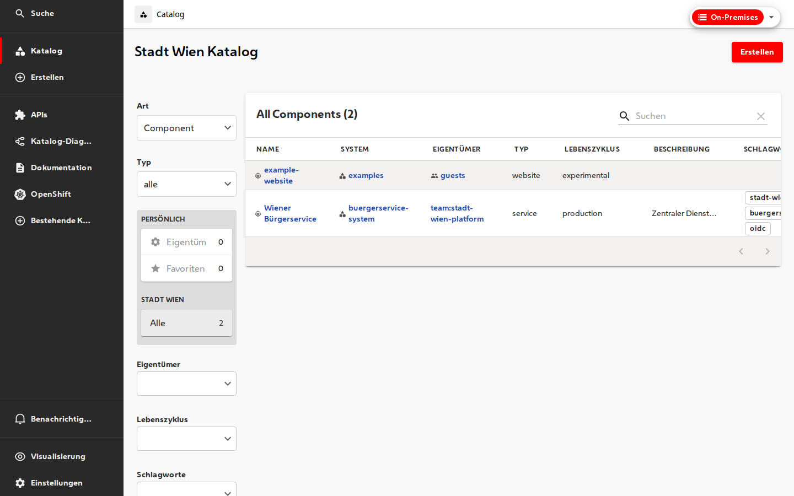
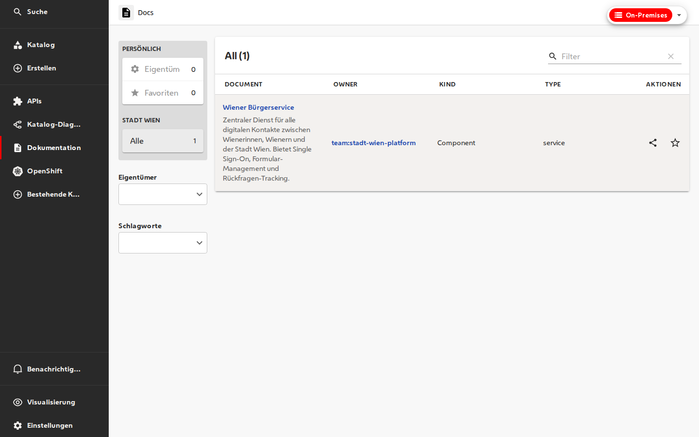
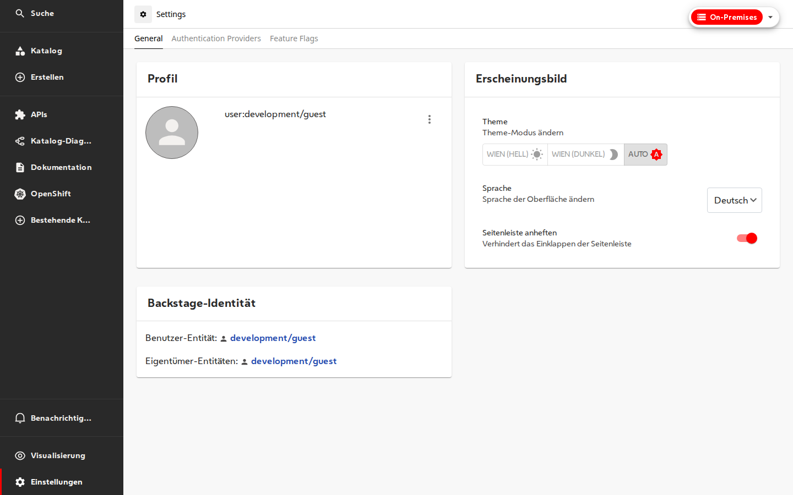
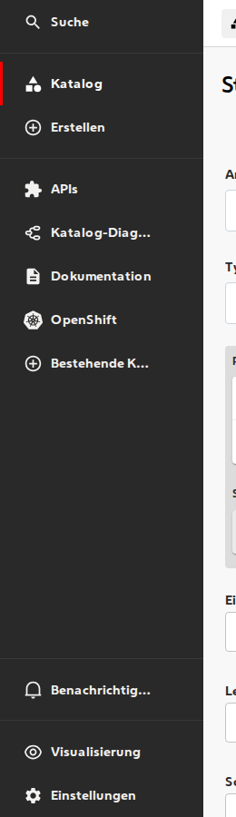
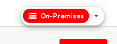
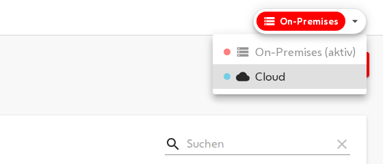
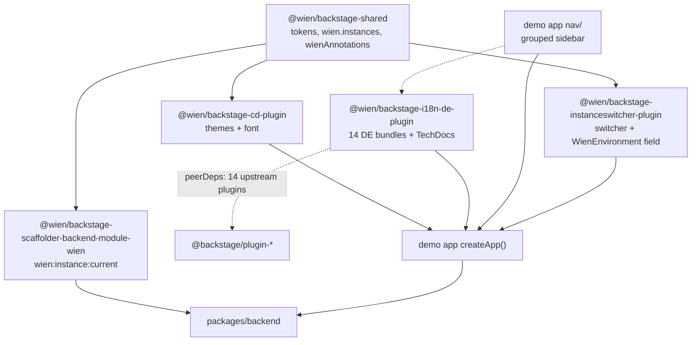

# hackstage — Stadt Wien Backstage Plugins (v2)

Publishable `@wien` frontend plugins for [Backstage](https://backstage.io), plus a minimal demo app for local development.

| Package | Purpose |
|---|---|
| `@wien/backstage-shared` | Brand colours + on-prem/cloud variant tokens (no React) |
| `@wien/backstage-cd-plugin` | Wien CD themes, Wiener Melange font |
| `@wien/backstage-i18n-de-plugin` | German translations, TechDocs i18n |
| `@wien/backstage-instanceswitcher-plugin` | Floating on-prem ↔ cloud instance switcher + `WienEnvironment` scaffolder field |
| `@wien/backstage-scaffolder-backend-module-wien` | `wien:instance:current` scaffolder action (backend) |



## Quick start (Cursor VM or local)

```sh
cd my-backstage-app
yarn install
yarn start
```

Open http://localhost:3000. For a two-instance demo, run a second app on port 3001 with `app-config.cloud.yaml`.

Verified running in this workspace via `yarn start` on ports 3000 (frontend) and 7007 (backend).

## Plugin screenshots

### `@wien/backstage-cd-plugin` — Corporate Design themes

Wien Rot header, dark sidebar, Wiener Melange typography, and Wien light/dark theme toggles in Settings → Darstellung.


### `@wien/backstage-i18n-de-plugin` — German translations

14 DE translation bundles, `wienI18nDeTranslationRef`, and translated TechDocs empty state. Sidebar layout is **not** included — see demo app below.

| TechDocs | Settings |
|---|---|
|  |  |

### Demo app — grouped German sidebar

The demo app wires `packages/app/src/nav/` (uses `wienI18nDeTranslationRef` from the i18n plugin):



### `@wien/backstage-instanceswitcher-plugin` — Instance switcher

Floating pill at top-right; on-prem (Wien Rot) vs cloud (Wasserblau) variants from `@wien/backstage-shared`.





### `@wien/backstage-shared` — Design tokens

No UI of its own. Provides `wienColors`, `WienInstanceVariant`, `getVariantDisplayColor()`, the `wien.instances` config resolver, and `wienAnnotations` (`wien.at/*` catalog keys) used by the CD, instance-switcher, and scaffolder packages above.

## Plugin dependency graph


```mermaid
flowchart TB
  Shared["@wien/backstage-shared<br/>tokens, wien.instances, wienAnnotations"]
  CD["@wien/backstage-cd-plugin<br/>themes + font"]
  I18N["@wien/backstage-i18n-de-plugin<br/>14 DE bundles + TechDocs"]
  DemoNav["demo app nav/<br/>grouped sidebar"]
  SW["@wien/backstage-instanceswitcher-plugin<br/>switcher + WienEnvironment field"]
  ScaffBE["@wien/backstage-scaffolder-backend-module-wien<br/>wien:instance:current"]

  Shared --> CD
  Shared --> SW
  Shared --> ScaffBE
  I18N -.->|"peerDeps: 14 upstream plugins"| Upstream["@backstage/plugin-*"]
  CD --> App["demo app createApp()"]
  I18N --> App
  DemoNav --> App
  DemoNav -.-> I18N
  SW --> App
  ScaffBE --> BE["packages/backend"]
  App --> BE
```

### `@wien/backstage-shared`

Framework-agnostic tokens. Import when you need `wienColors`, `readCurrentWienInstance()`, or `wienAnnotations` without the CD theme plugin. Contributes the canonical `wien.instances` config schema.

### `@wien/backstage-cd-plugin`

Depends on `@wien/backstage-shared`. Re-exports shared tokens from its stable API for backward compatibility.

### `@wien/backstage-i18n-de-plugin`

**Runtime dependencies:** `@backstage/frontend-plugin-api`, `@backstage/plugin-app-react`, MUI, `@backstage/ui`.

**Peer dependencies (host app must install):** the 14 upstream Backstage plugins whose translation refs this package extends, plus `@backstage/core-components` for the TechDocs page. Does not include sidebar layout — copy `packages/app/src/nav/` from the demo app if you want the grouped German sidebar.

### `@wien/backstage-instanceswitcher-plugin`

Depends on `@wien/backstage-shared` only (not the CD plugin). Reads the shared `wien.instances` registry and resolves the current deployment from `app.baseUrl`; the matching `variant` also drives the CD theme accent and the `wien:instance:current` scaffolder action.

## Wiring

```tsx
import { createApp } from '@backstage/frontend-defaults';
import catalogPlugin from '@backstage/plugin-catalog/alpha';
import { cdFeatures } from '@wien/backstage-cd-plugin/alpha';
import { i18nDeFeatures } from '@wien/backstage-i18n-de-plugin/alpha';
import { instanceSwitcherFeatures } from '@wien/backstage-instanceswitcher-plugin/alpha';

export default createApp({
  features: [
    catalogPlugin,
    ...cdFeatures,
    ...i18nDeFeatures,
    ...instanceSwitcherFeatures,
  ],
});
```

See each plugin README under `my-backstage-app/plugins/*/README.md` for extension IDs and config.

## Regenerate screenshots

With `yarn start` running:

```sh
cd my-backstage-app
yarn screenshots
```

## Optional: Docker

```sh
cd my-backstage-app
./docker/start.sh
```

Builds the backend image (if needed) and starts Postgres + Backstage at http://localhost:7007. Primary development path is `yarn start`.

## Repository layout

| Path | Purpose |
|---|---|
| `my-backstage-app/plugins/backstage-*-plugin/` | Five `@wien` packages (shared, three frontend plugins, one backend module) |
| `my-backstage-app/packages/app/` | Demo Backstage app |
| `my-backstage-app/packages/backend/` | Demo backend |
| `my-backstage-app/docker/` | Optional Docker Compose for backend smoke test |
| `docs/assets/` | Screenshots |

## Troubleshooting

- **`Module not found: Can't resolve '@wien/backstage-*-plugin/alpha'`** — run `yarn install` in `my-backstage-app/`, then restart `yarn start`.
- **Port already in use** — stop processes on ports 3000/7007 before restarting.
- **Cloud preview connection refused** — use the Cursor cloud preview URL or run locally after `yarn install`.

## Requirements

| Component | Version |
|---|---|
| Backstage | ≥ 1.36 (tested on 1.50.0) |
| Node | 22 or 24 |
| React | 17 or 18 |

## License

Code: Apache-2.0. Wiener Melange typeface: proprietary, © Stadt Wien.
