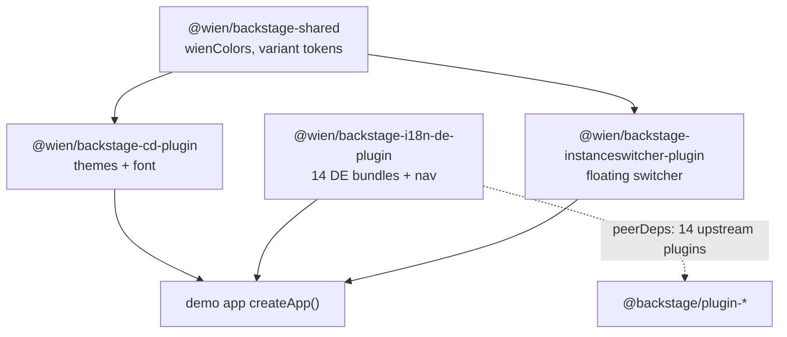

# hackstage — Stadt Wien Backstage Plugins

Publishable `@wien` frontend plugins for [Backstage](https://backstage.io), plus a minimal demo app for local development.

| Package | Purpose |
|---|---|
| `@wien/backstage-shared` | Brand colours + on-prem/cloud variant tokens (no React) |
| `@wien/backstage-cd-plugin` | Wien CD themes, Wiener Melange font |
| `@wien/backstage-i18n-de-plugin` | German translations, grouped sidebar, TechDocs i18n |
| `@wien/backstage-instanceswitcher-plugin` | Floating on-prem ↔ cloud instance switcher |


## Quick start (Cursor VM or local)

```sh
cd my-backstage-app
yarn install
yarn start
```

Open http://localhost:3000. For a two-instance demo, run a second app on port 3001 with `app-config.cloud.yaml`.

## Plugin dependency graph


```mermaid
flowchart TB
  Shared["@wien/backstage-shared<br/>wienColors, variant tokens"]
  CD["@wien/backstage-cd-plugin<br/>themes + font"]
  I18N["@wien/backstage-i18n-de-plugin<br/>14 DE bundles + nav"]
  SW["@wien/backstage-instanceswitcher-plugin<br/>floating switcher"]

  Shared --> CD
  Shared --> SW
  I18N -.->|"peerDeps: 14 upstream plugins"| Upstream["@backstage/plugin-*"]
  CD --> App["demo app createApp()"]
  I18N --> App
  SW --> App
```

### `@wien/backstage-shared`

Framework-agnostic tokens. Import when you need `wienColors` or `getVariantDisplayColor()` without the CD theme plugin.

### `@wien/backstage-cd-plugin`

Depends on `@wien/backstage-shared`. Re-exports shared tokens from its stable API for backward compatibility.

### `@wien/backstage-i18n-de-plugin`

**Runtime dependencies:** `@backstage/frontend-plugin-api`, `@backstage/plugin-app-react`, MUI, `@backstage/ui`.

**Peer dependencies (host app must install):** the 14 upstream Backstage plugins whose translation refs this package extends, plus `@backstage/core-components` for the translated sidebar and TechDocs page.

### `@wien/backstage-instanceswitcher-plugin`

Depends on `@wien/backstage-shared` only (not the CD plugin). Pair `instances[].variant` with `instanceVariant` on CD theme extensions in `app-config.yaml`.

## Wiring

```tsx
import { createApp } from '@backstage/frontend-defaults';
import catalogPlugin from '@backstage/plugin-catalog/alpha';
import { cdFeatures } from '@wien/backstage-cd-plugin/alpha';
import { i18nDeFeatures } from '@wien/backstage-i18n-de-plugin/alpha';
import { instanceSwitcherFeatures } from '@wien/backstage-instanceswitcher-plugin/alpha';

export default createApp({
  features: [
    catalogPlugin,
    ...cdFeatures,
    ...i18nDeFeatures,
    ...instanceSwitcherFeatures,
  ],
});
```

See each plugin README under `my-backstage-app/plugins/*/README.md` for extension IDs and config.

## Optional: Docker

```sh
cd my-backstage-app
./docker/start.sh
```

Builds the backend image (if needed) and starts Postgres + Backstage at http://localhost:7007. Primary development path is `yarn start`.

## Repository layout

| Path | Purpose |
|---|---|
| `my-backstage-app/plugins/backstage-*-plugin/` | Four `@wien` packages (shared + three frontend plugins) |
| `my-backstage-app/packages/app/` | Demo Backstage app |
| `my-backstage-app/packages/backend/` | Demo backend |
| `my-backstage-app/docker/` | Optional Docker Compose for backend smoke test |
| `docs/assets/` | Screenshots |

## Troubleshooting

- **`Module not found: Can't resolve '@wien/backstage-*-plugin/alpha'`** — run `yarn install` in `my-backstage-app/`, then restart `yarn start`.
- **Port already in use** — stop processes on ports 3000/7007 before restarting.
- **Cloud preview connection refused** — use the Cursor cloud preview URL or run locally after `yarn install`.

## Requirements

| Component | Version |
|---|---|
| Backstage | ≥ 1.36 (tested on 1.50.0) |
| Node | 22 or 24 |
| React | 17 or 18 |

## License

Code: Apache-2.0. Wiener Melange typeface: proprietary, © Stadt Wien.
