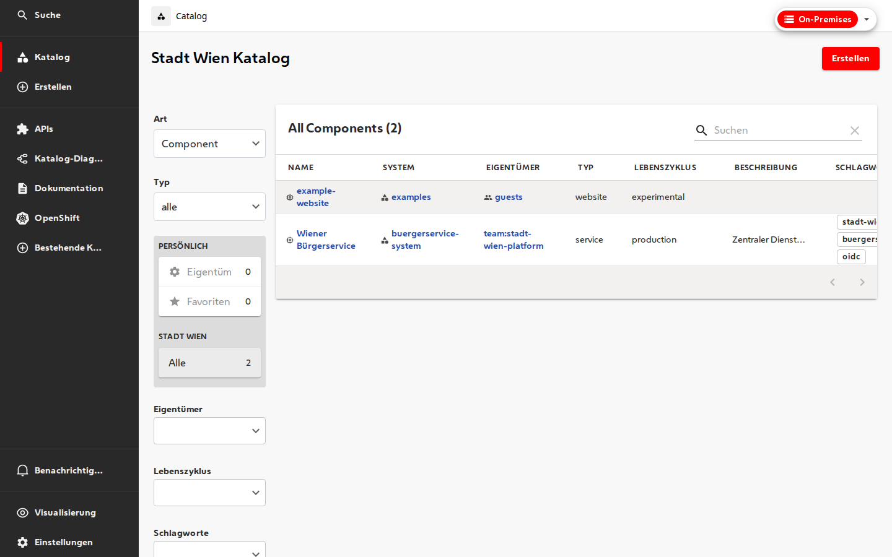

# my-backstage-app — Plugin development workspace

Minimal [Backstage](https://backstage.io) monorepo for developing and testing the four `@wien` plugins.

## Run locally

```sh
yarn install
yarn start
```

- Frontend: http://localhost:3000
- Backend: http://localhost:7007



Two-instance demo (on-prem + cloud):

```sh
# Terminal 1
yarn start

# Terminal 2
yarn workspace app start --config ../../app-config.yaml --config ../../app-config.cloud.yaml --port 3001
```

## Packages

| Package | Role |
|---|---|
| `plugins/backstage-shared` | `@wien/backstage-shared` — shared tokens |
| `plugins/backstage-cd-plugin` | `@wien/backstage-cd-plugin` |
| `plugins/backstage-i18n-de-plugin` | `@wien/backstage-i18n-de-plugin` |
| `plugins/backstage-instanceswitcher-plugin` | `@wien/backstage-instanceswitcher-plugin` |
| `packages/app` | Demo frontend |
| `packages/backend` | Demo backend |

## Commands

```sh
yarn test                              # all packages
yarn workspace @wien/backstage-shared test
yarn workspace @wien/backstage-cd-plugin test
yarn workspace @wien/backstage-i18n-de-plugin test
yarn workspace @wien/backstage-i18n-de-plugin i18n:coverage:check
yarn workspace @wien/backstage-instanceswitcher-plugin test
yarn screenshots                         # requires yarn start running
```

## Optional Docker backend

```sh
./docker/start.sh
```

See [../README.md](../README.md) for plugin architecture and dependency details.
