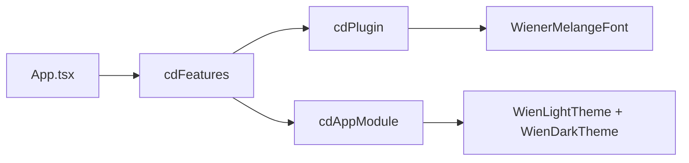

# @wien/backstage-cd-plugin

Stadt Wien Corporate Design for [Backstage](https://backstage.io) — brand colours, Wien light/dark themes, and the embedded **Wiener Melange** variable font.

## Installation

```sh
yarn workspace app add @wien/backstage-cd-plugin
```

Peer deps: React 17/18 and Backstage frontend system ≥ 1.36.

## Wiring

### `packages/app/src/App.tsx`

```tsx
import { cdFeatures } from '@wien/backstage-cd-plugin/alpha';

export default createApp({
  features: [catalogPlugin, ...cdFeatures],
});
```

### `app-config.yaml`

```yaml
app:
  extensions:
    - theme:app/light: false
    - theme:app/dark: false
    - theme:app/wien-light: true
    - theme:app/wien-dark: true
```

The accent (on-prem = Wien Rot, cloud = Wasserblau) is derived from `app.baseUrl`
matched against the shared `wien.instances` registry — see
`@wien/backstage-instanceswitcher-plugin`.

## Extensions

| Extension ID | Purpose |
|---|---|
| `theme:app/wien-light` | Light theme; accent from current `wien.instances` variant |
| `theme:app/wien-dark` | Dark theme; accent from current `wien.instances` variant |
| `app-root-element:cd/wiener-melange-font` | Embedded Wiener Melange `@font-face` |

Disable the font with `- app-root-element:cd/wiener-melange-font: false`.

## Screenshot


Settings → Darstellung shows **Wien (hell)** / **Wien (dunkel)** theme toggles:


## Stable API

```ts
import {
  wienColors,
  wienFontStack,
  wienLightTheme,
  wienDarkTheme,
  createWienTheme,
  getVariantDisplayColor,
  type WienInstanceVariant,
} from '@wien/backstage-cd-plugin';
```

## Architecture



## Troubleshooting

- **Themes not applied:** ensure default `theme:app/light` and `theme:app/dark` are disabled.
- **Wrong accent colour:** check the `variant` on the `wien.instances` entry whose `url` matches `app.baseUrl`.
- **Font not loading:** check that `app-root-element:cd/wiener-melange-font` is not disabled.

## Tests

```sh
yarn workspace @wien/backstage-cd-plugin test
```

## Related packages

- `@wien/backstage-shared` — shared brand colours and variant tokens (used internally)
- `@wien/backstage-i18n-de-plugin` — German UI and translated sidebar
- `@wien/backstage-instanceswitcher-plugin` — on-prem ↔ cloud switcher
