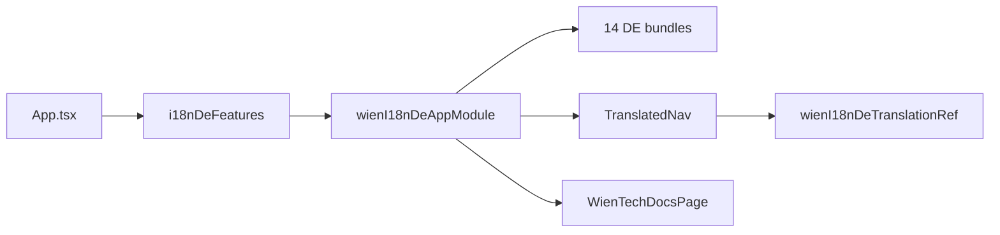

# @wien/backstage-i18n-de-plugin

German translations and translated UI chrome for [Backstage](https://backstage.io):

- 14 German translation bundles for core Backstage plugins
- grouped sidebar with DE/EN nav labels (`TranslatedNav`)
- TechDocs index page with a fully translated empty state

## Installation

```sh
yarn workspace app add @wien/backstage-i18n-de-plugin
```

Peer deps: the 14 upstream Backstage plugins whose translation refs this package extends (catalog, scaffolder, search, …), plus `@backstage/core-components`. The host app must install matching versions — see `package.json` `peerDependencies`.

## Wiring

### `packages/app/src/App.tsx`

```tsx
import { i18nDeFeatures } from '@wien/backstage-i18n-de-plugin/alpha';

export default createApp({
  features: [catalogPlugin, ...i18nDeFeatures],
});
```

### `app-config.yaml`

```yaml
app:
  extensions:
    - api:app/app-language:
        config:
          availableLanguages: [de, en]
          defaultLanguage: de

    - nav-content:app/translated-nav: true

    - nav-item:search: false
    - nav-item:catalog: false
    - nav-item:scaffolder: false
    - nav-item:user-settings: false

    - page:techdocs: false
```

## Extensions

| Extension ID | Purpose |
|---|---|
| `translation:app/wien-i18n-de-de` | Sidebar + nav title overrides |
| `translation:app/*-de` (×13) | Upstream plugin German bundles |
| `nav-content:app/translated-nav` | Grouped sidebar (Search / Menu / Settings) |
| `page:app/wien-techdocs` | Translatable TechDocs empty state on `/docs` |

## Stable API

```ts
import {
  wienI18nDeTranslationRef,
  slugifyNavItemId,
  wienGermanTranslations,
} from '@wien/backstage-i18n-de-plugin';
```

### Breaking renames (from monolith `@stadt-wien/backstage-plugin-cd`)

| Old | New |
|---|---|
| `wienCdTranslationRef` | `wienI18nDeTranslationRef` |
| ref id `wien-cd` | `i18n-de` |
| `wienGermanTranslations.wienCd` | `wienGermanTranslations.wienI18nDe` |

## Architecture



## Troubleshooting

- **`EXTENSION_OUTPUT_MISSING` for translated-nav:** ensure `NavContentBlueprint.make({ params: { component } })` pattern is used (not `factory()`).
- **Nav labels stay English:** enable `api:app/app-language` and set `defaultLanguage: de`.
- **TechDocs empty state untranslated:** disable upstream `page:techdocs` so `page:app/wien-techdocs` takes over.

## Tests

```sh
yarn workspace @wien/backstage-i18n-de-plugin test
yarn workspace @wien/backstage-i18n-de-plugin i18n:coverage:check
```

The coverage script enforces 100% German coverage for all upstream translation refs.

## Screenshots

| German sidebar | TechDocs | Settings |
|---|---|---|
|  |  |  |

## Related packages

- `@wien/backstage-cd-plugin` — themes and font (install separately)
