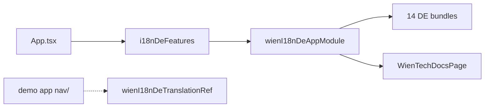

# @wien/backstage-i18n-de-plugin

German translations for [Backstage](https://backstage.io):

- 14 German translation bundles for core Backstage plugins
- `wienI18nDeTranslationRef` for custom nav labels (DE/EN)
- TechDocs index page with a fully translated empty state

This plugin does **not** ship a sidebar layout. The demo app wires a grouped
German sidebar in `packages/app/src/nav/` using `wienI18nDeTranslationRef`.

## Installation

```sh
yarn workspace app add @wien/backstage-i18n-de-plugin
```

Peer deps: the 14 upstream Backstage plugins whose translation refs this package extends, plus `@backstage/core-components` (TechDocs page). See `package.json` `peerDependencies`.

## Wiring

### `packages/app/src/App.tsx`

```tsx
import { i18nDeFeatures } from '@wien/backstage-i18n-de-plugin/alpha';

export default createApp({
  features: [catalogPlugin, ...i18nDeFeatures],
});
```

### `app-config.yaml`

```yaml
app:
  extensions:
    - api:app/app-language:
        config:
          availableLanguages: [de, en]
          defaultLanguage: de

    - page:techdocs: false
```

Page headers and tabs from `PageBlueprint` / `SubPageBlueprint` are **not** covered by translation refs. Copy the `page:*` title overrides from the demo `app-config.yaml` (Settings, Catalog Graph, Search, …).

For a grouped German sidebar, copy `packages/app/src/nav/` from this repo into your app and register `demoAppModule` (see demo app).

## Extensions

| Extension ID | Purpose |
|---|---|
| `translation:app/wien-i18n-de-de` | Nav title overrides + sidebar group strings |
| `translation:app/*-de` (×13) | Upstream plugin German bundles |
| `page:app/wien-techdocs` | Translatable TechDocs empty state on `/docs` |

## Stable API

```ts
import {
  wienI18nDeTranslationRef,
  slugifyNavItemId,
  wienGermanTranslations,
} from '@wien/backstage-i18n-de-plugin';
```

Use `wienI18nDeTranslationRef` + `slugifyNavItemId` in your own `NavContent` component for translated sidebar labels.

## Architecture



## Troubleshooting

- **Nav labels stay English:** enable `api:app/app-language` and set `defaultLanguage: de`; ensure your app wires a NavContent that uses `wienI18nDeTranslationRef`.
- **TechDocs empty state untranslated:** disable upstream `page:techdocs` so `page:app/wien-techdocs` takes over.

## Tests

```sh
yarn workspace @wien/backstage-i18n-de-plugin test
yarn workspace @wien/backstage-i18n-de-plugin i18n:coverage:check
```

## Screenshots

| TechDocs | Settings |
|---|---|
|  |  |

Grouped sidebar screenshot lives in the demo app README (`plugin-i18n-sidebar-de.png`).

## Related packages

- `@wien/backstage-cd-plugin` — themes and font (install separately)
