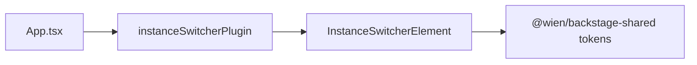

# @wien/backstage-instanceswitcher-plugin

Floating instance switcher for [Backstage](https://backstage.io) — links sibling deployments (on-prem ↔ cloud) with variant-coloured pills.

Uses `@wien/backstage-shared` for variant colours. Does **not** depend on the CD theme plugin.

## Installation

```sh
yarn workspace app add @wien/backstage-shared
yarn workspace app add @wien/backstage-instanceswitcher-plugin
```

## Wiring

### `packages/app/src/App.tsx`

```tsx
import { instanceSwitcherFeatures } from '@wien/backstage-instanceswitcher-plugin/alpha';

export default createApp({
  features: [catalogPlugin, ...instanceSwitcherFeatures],
});
```

### `app-config.yaml`

The deployment registry lives once in `wien.instances`. The **current** instance
is resolved by matching `app.baseUrl` against each entry's `url`, so there is no
`currentInstanceId` to keep in sync per environment.

## Behaviour

1. **Expanded pill** at page top on load (variant icon + label + menu chevron).
2. After **`compactDelayMs`** (default 4000 ms) idle at top, shrinks to a **32px variant-coloured circle** (icon only).
3. **Hover, focus, or open menu** expands back to the full pill.
4. **Scroll down** hides the switcher completely (`scrollThreshold`, default 16 px).
5. Set **`compactDelayMs: 0`** to keep the full pill at all times.
6. **`offsetTop`** / **`offsetRight`** (defaults **8** / **20** px) pin the switcher to the viewport corner.

```yaml
app:
  baseUrl: https://backstage.internal.example.com # picks the current instance
  extensions:
    - app-root-element:instanceswitcher/instance-switcher:
        config:
          scrollThreshold: 16
          compactDelayMs: 4000   # 0 = never compact
          position: top-right
          offsetTop: 8
          offsetRight: 20

# Shared registry — also drives the CD theme accent and the
# wien:instance:current scaffolder action.
wien:
  instances:
    - id: on-prem
      label: On-Premises
      url: https://backstage.internal.example.com
      variant: on-prem
    - id: cloud
      label: Cloud
      url: https://backstage.cloud.example.com
      variant: cloud
```

The matching `instances[].variant` automatically drives the `@wien/backstage-cd-plugin` theme accent for the current deployment — no separate theme config needed.

## Screenshots


## Scaffolder field: `WienEnvironment`

The plugin also ships a **read-only** scaffolder form field that displays the
current deployment (resolved from `app.baseUrl`, same as the switcher). Use it
in templates via `ui:field`:

```yaml
parameters:
  - title: Component identity
    properties:
      # Read-only — value cannot be changed in the form.
      # If you want to change environment - use the multi instance switcher
      # on the top right.
      environment:
        title: Environment
        description: >-
          If you want to change environment - use the multi instance switcher
          on the top right
        type: string
        ui:field: WienEnvironment
```

The field is disabled and shows the current instance label (e.g. "On-Premises").
Override the helper text with `ui:description` if needed. The component is
lazy-loaded, so apps that never open the scaffolder pay no bundle cost.

## Extensions

| Extension ID | Purpose |
|---|---|
| `app-root-element:instanceswitcher/instance-switcher` | Floating top instance picker |
| `scaffolder-form-field:instanceswitcher/wien-environment` | Read-only `WienEnvironment` template field |
| `translation:app/instanceswitcher-de` | DE/EN strings for the switcher UI |

## Architecture



## Screenshot

Uses `getVariantDisplayColor()` from `@wien/backstage-shared` — on-prem pill is Wien Rot, cloud entry uses Wasserblau:


## Troubleshooting

- **Switcher not visible:** appears only when scrolled to the top (`scrollThreshold`, default 16px).
- **Still full pill at top:** wait for `compactDelayMs` (default 4s) or hover to expand from compact circle.
- **Wrong pill colour:** check the `variant` on the matching `wien.instances` entry (matched to `app.baseUrl`).
- **Fewer than two instances:** switcher renders nothing by design.

## Tests

```sh
yarn workspace @wien/backstage-instanceswitcher-plugin test
```

## Related packages

- `@wien/backstage-shared` — variant colours (required)
- `@wien/backstage-cd-plugin` — optional; provides matching theme accents per variant
