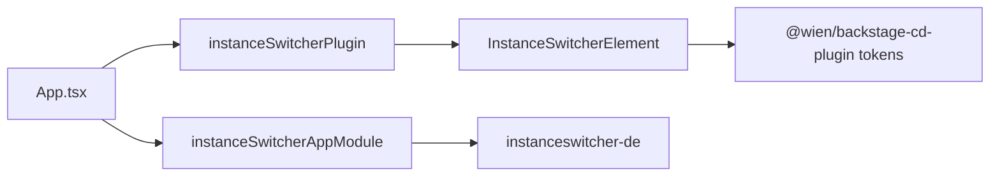

# @wien/backstage-instanceswitcher-plugin

Floating instance switcher for [Backstage](https://backstage.io) — links sibling deployments (on-prem ↔ cloud) with variant-coloured pills.

Depends on `@wien/backstage-cd-plugin` for `getVariantDisplayColor` and `WienInstanceVariant`.

## Installation

```sh
yarn workspace app add @wien/backstage-cd-plugin
yarn workspace app add @wien/backstage-instanceswitcher-plugin
```

## Wiring

### `packages/app/src/App.tsx`

```tsx
import { cdFeatures } from '@wien/backstage-cd-plugin/alpha';
import { instanceSwitcherFeatures } from '@wien/backstage-instanceswitcher-plugin/alpha';

export default createApp({
  features: [catalogPlugin, ...cdFeatures, ...instanceSwitcherFeatures],
});
```

### `app-config.yaml`

```yaml
app:
  extensions:
    - theme:app/wien-light:
        config:
          instanceVariant: on-prem
    - theme:app/wien-dark:
        config:
          instanceVariant: on-prem

    - app-root-element:instanceswitcher/instance-switcher:
        config:
          currentInstanceId: on-prem
          scrollThreshold: 16
          instances:
            - id: on-prem
              label: On-Premises
              url: https://backstage.internal.example.com
              variant: on-prem
            - id: cloud
              label: Cloud
              url: https://backstage.cloud.example.com
              variant: cloud
```

Pair `instances[].variant` with `instanceVariant` on the CD theme extensions per deployment.

## Extensions

| Extension ID | Purpose |
|---|---|
| `app-root-element:instanceswitcher/instance-switcher` | Floating top instance picker |
| `translation:app/instanceswitcher-de` | DE/EN strings for the switcher UI |

### Breaking extension ID migration

| Old (monolith) | New |
|---|---|
| `app-root-element:wien-cd/instance-switcher` | `app-root-element:instanceswitcher/instance-switcher` |

## Architecture



## Troubleshooting

- **Switcher not visible:** appears only when scrolled to the top (`scrollThreshold`, default 16px).
- **Wrong pill colour:** match `instances[].variant` with theme `instanceVariant` from CD plugin.
- **Fewer than two instances:** switcher renders nothing by design.

## Tests

```sh
yarn workspace @wien/backstage-instanceswitcher-plugin test
```

## Related packages

- `@wien/backstage-cd-plugin` — required peer for variant colours
